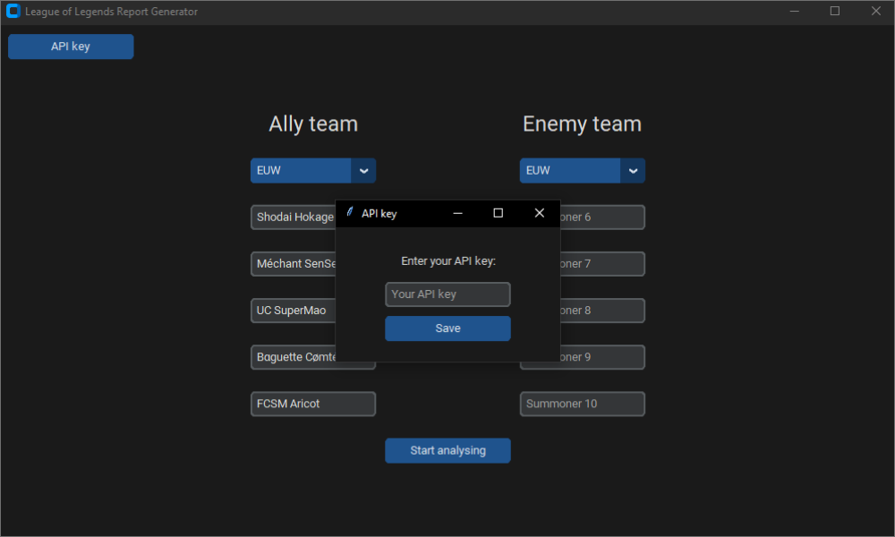
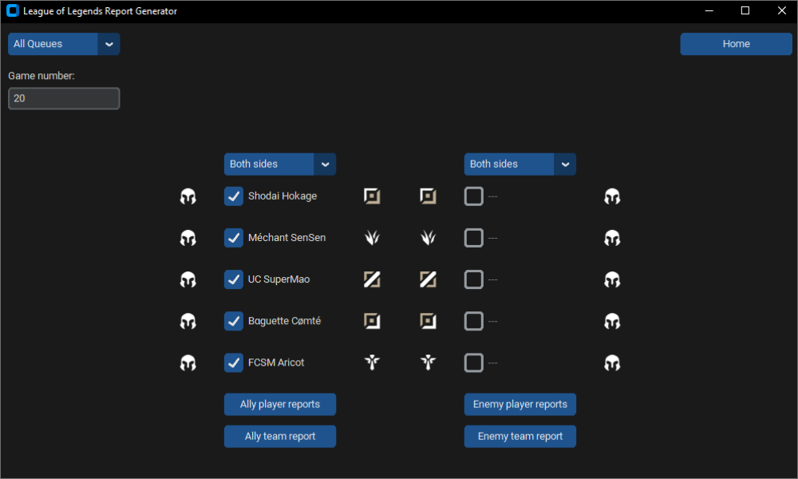
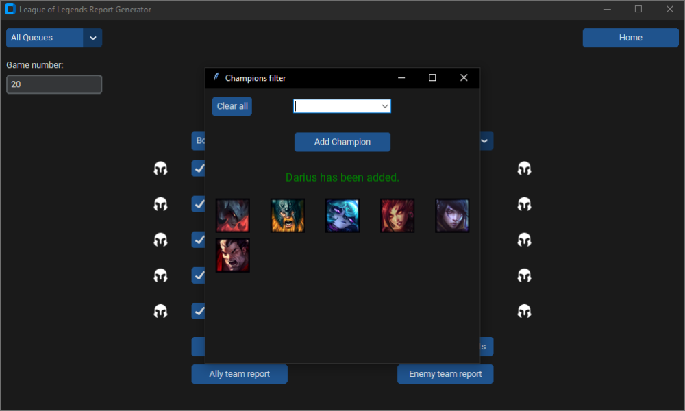

# League of Legends Report Generator

League of Legends Report Generator is an unofficial League of Legends (LoL) project aimed at allowing LoL team coaches to better prepare their team's players against opposing teams by offering them the possibility of obtaining analyzes and predictions on the habits of opposing players thanks to artificial intelligence. The project can nevertheless be used by anyone (you can analyze your own habits for example!).

It is developed in Python and uses the [CustomTkinter](https://github.com/TomSchimansky/CustomTkinter) library for the interface. Data recovery is performed from the [Riot Games's API](https://developer.riotgames.com/apis) using the [Riot Watcher](https://github.com/pseudonym117/Riot-Watcher) library.

The project is still under development, it only provides a creep score analysis report and only works on Windows. We hope to be able to provide in the near future the possibility of obtaining predictions on the habits of players.

## Installation

Download the project either in zip and unzipping it or by entering the following command:
```
git clone https://github.com/Nexusprime22/League_Of_Legends_Report_Generator.git
```
Start then the interface by executing the `report_generator.exe` file.

## How to use the interface

### Enter your API key

As we currently don't have a key that can accommodate multiple user requests, you must enter an API key.
First step is to generate an API key on [Riot Games Developer Website](https://developer.riotgames.com/) using your Riot account and copying it. Then, you will be able to add this key to our interface using the API key button in order to use it.

Your key will be valid for 24 hours, you will then need to repeat the same step as before to continue using the interface.

**NB:** If you get error messages when trying to start the analyse even though you added the API key, verify on [Riot Games Developer Website](https://developer.riotgames.com/) that the key that you entered is still valid. You also may wait a minute after generating the key to be usable.


| _API key modal to put the API key_

### Enter the summoner names

If you entered your API key correctly, you can use the interface.
Enter the summoner names of the players that you want to analyse and their corresponding region (up to 10 players but you can put less). The team of the players is important if you want to do a collective analysis between them after.


| _Home page to put summoner names_

###

If summoner names are correct, you will be redirected to the main page where you will have the possibility to generate the reports of the checked summoners.


| _Main page to start the analysis_

### Add filters for your analysis

You can use several filters to further customize your analysis. Filters are listed and explained below:

- Queue type (All Queues, Ranked Solo/Duo, Ranked Flex)<br />
  -> Search for games in the specific queue. If `All Queues` is selected, it will get both Solo/Duo and flex games.
- Game number<br />
  -> The number of games we want to analyse (note that it corresponds to the last N number of games, this means that if some filters are not met for some games, it is possible to have less than the N number of games specified), the more games we request, the longer you will have to wait for the analysis to finish.
- Team side (Both sides, Blue side, Red side)<br />
  -> The side of the games we want to analyse for the specific team. If `Both sides` is selected, it will get both Blue side and Red side games.
- Role (Fill, Top, Jungle, Mid, Bottom, Support)<br />
  -> The role of the games we want to analyse for the corresponding summoner that we can change when clicking on the role icons. If the `Fill` icon is selected, it will get any game no matter what role it is for this particular summoner.
- Champion<br />
  -> The champions of the games we want to analyse for the corresponding summoner that we can change when clicking on the champion icon. It opens a modal where it is possible to add using an input any champion (tip: press `Return` to add champions faster!) and removing them when clicking on them. If no champion is set as filter, it will get any game no matter what champion it is for this particular summoner.


| _Champions modal filter to set specific champions to analyse_

### Start your analysis

First make sure you have checked or unchecked the players you want to analyse.

You can then generate two types of reports by clicking on the corresponding button which are:

- Player reports
- Team report

Player reports are individual reports containing the creep score comparison between the summoner and their opponents in the last N games specified which also respects the filters. It occurs for all checked summoners in the team (Ally or Enemy depending on the button clicked).

Team reports are collective reports containing the creep score comparison between the summoners and their opponents in the last N games specified which also respects the filters. It occurs for all checked summoners in the team (Ally or Enemy depending on the button clicked). The difference for this report is that all the summoners checked must be in the same team and all filters of each summoner must be valid which makes the customization endless.

When starting the analysis, a progress bar will appear to show the progress of the analysis.<br />
**DO NOT CLOSE THE PROGRESS BAR WINDOW**.<br />
The reports are then saved in the `data/reports` folder as PDF files. If any filter was not met, the report will not be created.

## License

Distributed under the MIT License. See `LICENSE` for more information.

## Contact
Antonin Winterstein - antonin.winterstein@gmail.com

Killian Maxel - nexusprimekillian@gmail.com
